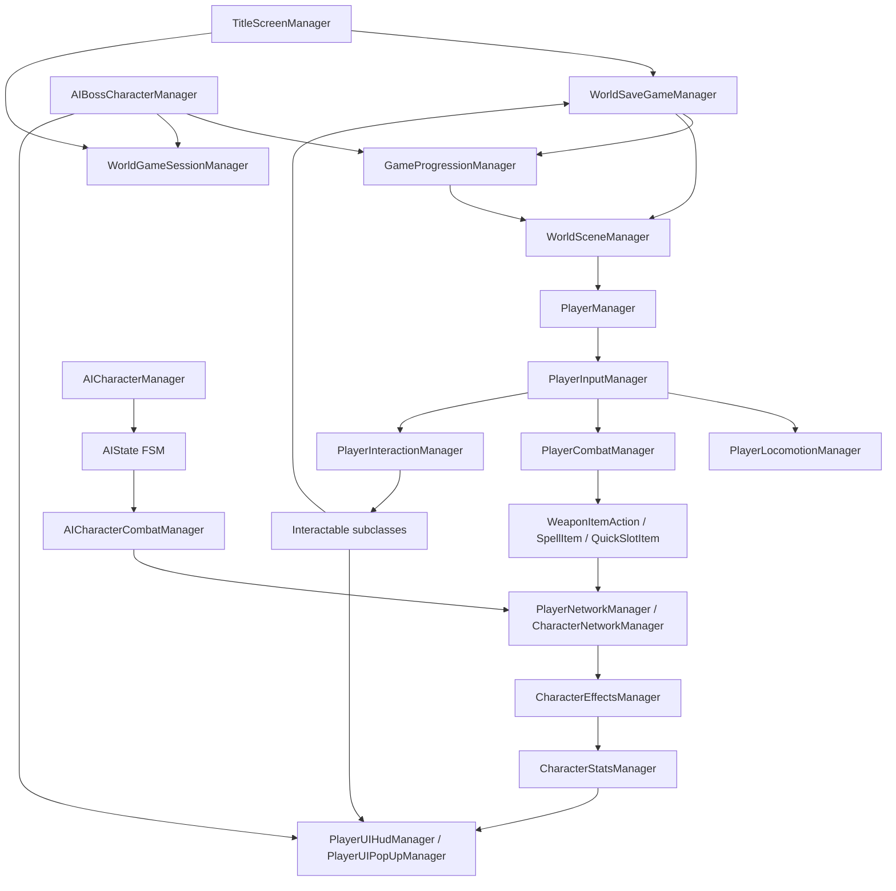

# Chức năng chính trong game Eternal Hollow

Tài liệu này được tổng hợp từ toàn bộ vùng code gameplay trong `Assets/Game/Scripts`, file `PROJECT_ROADMAP.md`, và báo cáo `D:/TaiLieuNam5/DoAnTotNghiep/Đồ án/Báo cáo đồ án Final.docx`.

## 1. Luồng khởi động, chọn chế độ chơi và tạo nhân vật

**Class/file chính**
- `Assets/Game/Scripts/Menu Scene/TitleScreenManager.cs`
- `Assets/Game/Scripts/Function/CharacterClass.cs`
- `Assets/Game/Scripts/World Managers/WorldSaveGameManager.cs`
- `Assets/Game/Scripts/World Managers/GameProgressionManager.cs`

**Hàm dùng**
- `TitleScreenManager.PressStart()`
- `TitleScreenManager.SelectSingleplayerMode()`
- `TitleScreenManager.SelectMultiplayerMode()`
- `TitleScreenManager.AttemptToCreateNewCharacter()`
- `TitleScreenManager.OpenCharacterCreationMenu()`
- `TitleScreenManager.SelectClass(int classID)`
- `TitleScreenManager.PreviewClass(int classID)`
- `TitleScreenManager.StartNewGame()`
- `TitleScreenManager.SetCharacterClass(...)`
- `WorldSaveGameManager.AttemptToCreateNewGame()`
- `GameProgressionManager.ResetForNewGame(int selectedStartingClassID)`

**Hàm quan trọng nhất**
- `TitleScreenManager.SetCharacterClass(...)`: gán chỉ số, vũ khí, giáp, quick slot, body/preview cho class khởi đầu.

**Móc nối**
- UI title screen gọi `TitleScreenManager`.
- Khi chọn class, dữ liệu `CharacterClass[] startingClasses` được dùng để preview và apply vào `PlayerManager`.
- Khi bấm Start, `TitleScreenManager.StartNewGame()` gọi `WorldSaveGameManager.AttemptToCreateNewGame()`.
- `WorldSaveGameManager` gọi `GameProgressionManager.ResetForNewGame()` để reset map, class đã chọn, trạng thái thắng/thua.
- Sau đó gọi `WorldSceneManager.LoadWorldScene(...)` để vào map đầu tiên.

**Cách hoạt động**
- Người chơi vào title screen, chọn singleplayer/multiplayer, tạo nhân vật.
- Class khởi đầu quyết định bộ stat, trang bị tay phải/tay trái, giáp và item nhanh.
- Save slot mới được tạo, progression được reset về map 1, rồi load world scene.

## 2. Tải game và lưu hồ sơ nhân vật

**Class/file chính**
- `Assets/Game/Scripts/World Managers/WorldSaveGameManager.cs`
- `Assets/Game/Scripts/Game Saving/SaveFileDataWriter.cs`
- `Assets/Game/Scripts/Game Saving/CharacterSaveData.cs`
- `Assets/Game/Scripts/Character/Player/PlayerManager.cs`

**Hàm dùng**
- `WorldSaveGameManager.LoadAllCharacterProfiles()`
- `WorldSaveGameManager.LoadGame()`
- `WorldSaveGameManager.SaveGame()`
- `WorldSaveGameManager.DeleteGame(CharacterSlot characterSlot)`
- `SaveFileDataWriter.CreateNewCharacterSaveFile(CharacterSaveData characterData)`
- `SaveFileDataWriter.LoadSaveFile()`
- `PlayerManager.SaveGameDataToCurrentCharacterData(ref CharacterSaveData data)`
- `PlayerManager.LoadGameDataFromCurrentCharacterData(ref CharacterSaveData data)`
- `GameProgressionManager.LoadFromCharacterData(CharacterSaveData characterData)`
- `GameProgressionManager.SaveToCharacterData(CharacterSaveData characterData)`

**Hàm quan trọng nhất**
- `WorldSaveGameManager.SaveGame()`: gom dữ liệu từ player và progression rồi ghi xuống file save.

**Móc nối**
- `TitleScreenManager` chọn save slot rồi gọi `WorldSaveGameManager.LoadGame()`.
- `WorldSaveGameManager.LoadGame()` đọc JSON qua `SaveFileDataWriter`, nạp progression qua `GameProgressionManager`, sau đó load scene.
- Khi cần lưu, `WorldSaveGameManager.SaveGame()` gọi `player.SaveGameDataToCurrentCharacterData(...)`, `GameProgressionManager.SaveToCharacterData(...)`, rồi ghi file.

**Cách hoạt động**
- Game có nhiều slot nhân vật.
- Save chứa chỉ số, trang bị, inventory, rune, boss đã đánh bại, Site of Grace, map hiện tại, class khởi đầu, thời gian chơi và dữ liệu merchant.
- Khi load lại, player được dựng lại từ `CharacterSaveData`, sau đó teleport tới Site of Grace/checkpoint phù hợp.

## 3. Điều khiển nhân vật và input gameplay

**Class/file chính**
- `Assets/Game/Scripts/Character/Player/PlayerInputManager.cs`
- `Assets/Game/Scripts/Character/Player/PlayerManager.cs`
- `Assets/Game/Scripts/Character/Player/PlayerLocomotionManager.cs`
- `Assets/Game/Scripts/Character/Player/PlayerCamera.cs`

**Hàm dùng**
- `PlayerInputManager.OnEnable()`
- `PlayerInputManager.HandleAllInputs()`
- `PlayerInputManager.HandlePlayerMovementInput()`
- `PlayerInputManager.HandleCameraMovementInput()`
- `PlayerInputManager.HandleDodgeInput()`
- `PlayerInputManager.HandleJumpInput()`
- `PlayerInputManager.HandleSprintInput()`
- `PlayerInputManager.HandleRBInput()`
- `PlayerInputManager.HandleRTInput()`
- `PlayerInputManager.HandleInteractionInput()`
- `PlayerLocomotionManager.HandleAllMovement()`
- `PlayerLocomotionManager.HandleSprinting()`
- `PlayerLocomotionManager.AttemptToPerformDodge()`
- `PlayerLocomotionManager.AttemptToPerformJump()`

**Hàm quan trọng nhất**
- `PlayerInputManager.HandleAllInputs()`: điểm điều phối toàn bộ input gameplay mỗi frame.

**Móc nối**
- Unity Input System sinh input vào `PlayerInputManager`.
- `PlayerInputManager` gọi các manager con của `PlayerManager`: locomotion, combat, inventory, interaction.
- `PlayerManager.Update()` chỉ xử lý khi `IsOwner`, sau đó gọi `playerLocomotionManager.HandleAllMovement()` và hồi stamina.
- Các trạng thái input quan trọng được ghi vào `NetworkVariable` trong `PlayerNetworkManager` để đồng bộ.

**Cách hoạt động**
- Input được chia thành camera, movement, action, bumper, trigger, two-hand, lock-on và UI.
- Khi menu mở, `IsGameplayInputLocked()` khóa input gameplay, chỉ giữ input đóng menu.
- Di chuyển dựa theo hướng camera, có sprint, sneak, dodge, jump, lock-on và aiming.

## 4. Di chuyển, né, nhảy, chạy và xoay hướng

**Class/file chính**
- `Assets/Game/Scripts/Character/Player/PlayerLocomotionManager.cs`
- `Assets/Game/Scripts/Character/CharacterLocomotionManager.cs`
- `Assets/Game/Scripts/Character/CharacterAnimatorManager.cs`

**Hàm dùng**
- `PlayerLocomotionManager.HandleAllMovement()`
- `PlayerLocomotionManager.HandleGroundedMovement()`
- `PlayerLocomotionManager.HandleRotation()`
- `PlayerLocomotionManager.HandleSprinting()`
- `PlayerLocomotionManager.AttemptToPerformDodge()`
- `PlayerLocomotionManager.AttemptToPerformJump()`
- `CharacterAnimatorManager.UpdateAnimatorMovementParameters(...)`

**Hàm quan trọng nhất**
- `PlayerLocomotionManager.HandleAllMovement()`: gom xử lý grounded movement, rotation, jump và free fall.

**Móc nối**
- `PlayerInputManager` cập nhật `horizontal_Input`, `vertical_Input`, `moveAmount`.
- `PlayerManager.Update()` gọi locomotion.
- Locomotion cập nhật animator và `NetworkVariable` movement để remote client thấy đúng animation.

**Cách hoạt động**
- Nếu không lock-on, hướng di chuyển xoay theo camera.
- Nếu lock-on, nhân vật ưu tiên xoay mặt về target, trừ khi sprint/roll.
- Sprint trừ stamina theo thời gian.
- Dodge/jump kiểm tra stamina, grounded/action flag rồi phát animation và trừ stamina.

## 5. Chiến đấu cận chiến, combo, block, parry và critical

**Class/file chính**
- `Assets/Game/Scripts/Character/Player/PlayerCombatManager.cs`
- `Assets/Game/Scripts/Character/CharacterCombatManager.cs`
- `Assets/Game/Scripts/Weapon Actions/WeaponItemAction.cs`
- `Assets/Game/Scripts/Weapon Actions/LightAttackWeaponItemAction.cs`
- `Assets/Game/Scripts/Weapon Actions/HeavyAttackWeaponItemAction.cs`
- `Assets/Game/Scripts/Weapon Actions/OffHandMeleeAction.cs`
- `Assets/Game/Scripts/Items/Weapons/WeaponItem.cs`
- `Assets/Game/Scripts/Colliders/MeleeWeaponDamageCollider.cs`
- `Assets/Game/Scripts/Colliders/DamageCollider.cs`
- `Assets/Game/Scripts/Character/CharacterNetworkManager.cs`

**Hàm dùng**
- `PlayerInputManager.HandleRBInput()`
- `PlayerInputManager.HandleRTInput()`
- `PlayerCombatManager.PerformWeaponBasedAction(WeaponItemAction action, WeaponItem weapon)`
- `WeaponItemAction.AttemptToPerformAction(...)`
- `LightAttackWeaponItemAction.AttemptToPerformAction(...)`
- `HeavyAttackWeaponItemAction.AttemptToPerformAction(...)`
- `PlayerCombatManager.DrainStaminaBasedOnAttack()`
- `MeleeWeaponDamageCollider.DamageTarget(CharacterManager damageTarget)`
- `CharacterNetworkManager.NotifyTheServerOfCharacterDamageServerRpc(...)`
- `CharacterNetworkManager.NotifyTheServerOfCharacterDamageClientRpc(...)`
- `CharacterCombatManager.AttemptRiposte(...)`
- `CharacterCombatManager.AttemptBackstab(...)`
- `PlayerCombatManager.AttemptRiposte(...)`
- `PlayerCombatManager.AttemptBackstab(...)`

**Hàm quan trọng nhất**
- `PlayerCombatManager.PerformWeaponBasedAction(...)`: cầu nối giữa input và action của vũ khí.

**Móc nối**
- Input RB/RT/LB/LT chọn action tương ứng.
- `PlayerCombatManager` gọi `WeaponItemAction`.
- Action chọn animation, set `currentWeaponBeingUsed`, bật flag hành động.
- Animation event mở/đóng damage collider.
- Collider va chạm target thì gửi damage qua `CharacterNetworkManager.NotifyTheServerOfCharacterDamageServerRpc(...)`.
- Client nhận RPC tạo `TakeDamageEffect` hoặc critical effect để trừ máu, poise, play animation, VFX.

**Cách hoạt động**
- Mỗi vũ khí là `WeaponItem` chứa damage, stamina cost, animation, modifier.
- Combo dùng flag `canComboWithMainHandWeapon` và `canComboWithOffHandWeapon`.
- Block dùng absorption/stability từ vũ khí đang dùng.
- Riposte/backstab kiểm tra target có thể critical hay không, sau đó gửi RPC riêng để đồng bộ animation và damage.

## 6. Cung tên, projectile và aiming

**Class/file chính**
- `Assets/Game/Scripts/Weapon Actions/AimAction.cs`
- `Assets/Game/Scripts/Weapon Actions/FireProjectileAction.cs`
- `Assets/Game/Scripts/Character/Player/PlayerCombatManager.cs`
- `Assets/Game/Scripts/Character/Player/PlayerNetworkManager.cs`
- `Assets/Game/Scripts/Colliders/RangedProjectileDamageCollider.cs`
- `Assets/Game/Scripts/Items/Equipment/RangedProjectileItem.cs`

**Hàm dùng**
- `AimAction.AttemptToPerformAction(...)`
- `FireProjectileAction.AttemptToPerformAction(...)`
- `PlayerCombatManager.ReleaseArrow()`
- `PlayerNetworkManager.NotifyServerOfDrawnProjectileServerRpc(int projectileID)`
- `PlayerNetworkManager.NotifyServerOfReleasedProjectileServerRpc(...)`
- `PlayerNetworkManager.NotifyServerOfReleasedProjectileClientRpc(...)`
- `PlayerNetworkManager.PerformReleasedProjectileFromRpc(...)`

**Hàm quan trọng nhất**
- `PlayerCombatManager.ReleaseArrow()`: tạo projectile thật, tính hướng bắn, trừ ammo và đồng bộ phát bắn.

**Móc nối**
- Input giữ/ngắm kích hoạt `AimAction`.
- Fire action tạo trạng thái drawn projectile qua ServerRpc/ClientRpc.
- Animation event gọi `ReleaseArrow()`.
- Owner instantiate projectile, set damage collider, add force, sau đó gửi RPC để client khác dựng lại projectile tương tự.

**Cách hoạt động**
- Nếu đang aim, hướng bắn lấy từ `PlayerCamera.instance.aimDirection`.
- Nếu lock-on, projectile quay về lock-on target.
- Nếu không lock-on, projectile bay theo hướng forward của player.
- UI projectile quick slot được cập nhật sau khi trừ ammo.

## 7. Phép thuật và hiệu ứng warm-up/cast

**Class/file chính**
- `Assets/Game/Scripts/Items/Spells/SpellItem.cs`
- `Assets/Game/Scripts/Items/Spells/FireBallSpell.cs`
- `Assets/Game/Scripts/Items/Spells/FireBallManager.cs`
- `Assets/Game/Scripts/Items/Spells/SpellProjectileDamageCollider.cs`
- `Assets/Game/Scripts/Weapon Actions/CastIncantationAction.cs`
- `Assets/Game/Scripts/Character/Player/PlayerCombatManager.cs`

**Hàm dùng**
- `CastIncantationAction.AttemptToPerformAction(...)`
- `SpellItem.AttemptToCastSpell(PlayerManager player)`
- `SpellItem.InstantiateWarmUpSpellFX(PlayerManager player)`
- `SpellItem.SuccessfullyCastSpell(PlayerManager player)`
- `SpellItem.SuccessfullyChargeSpell(PlayerManager player)`
- `FireBallSpell.AttemptToCastSpell(...)`
- `FireBallSpell.InstantiateWarmUpSpellFX(...)`
- `FireBallSpell.SuccessfullyCastSpell(...)`
- `PlayerCombatManager.InstantiateSpellWarmUpFX()`
- `PlayerCombatManager.SuccessfullyCastSpell()`
- `PlayerCombatManager.SuccessfullyChargeSpell()`

**Hàm quan trọng nhất**
- `SpellItem.SuccessfullyCastSpell(...)` và override trong `FireBallSpell`: đây là điểm tạo spell/projectile thực tế sau animation.

**Móc nối**
- Input/weapon action gọi cast action.
- Cast action kiểm tra spell hiện tại trong inventory.
- Animation event gọi các hàm trong `PlayerCombatManager`, rồi chuyển tiếp sang `SpellItem`.
- Spell tạo FX warm-up, release object, damage collider.

**Cách hoạt động**
- Spell là ScriptableObject nên dễ cấu hình damage, FP cost, animation, prefab.
- Player giữ spell hiện tại trong `PlayerInventoryManager.currentSpell`.
- Khi cast thành công, spell xử lý prefab và damage riêng; ví dụ Fireball có warm-up/release/full-charge.

## 8. Item nhanh, flask và buff charm

**Class/file chính**
- `Assets/Game/Scripts/Items/Quick Slot Items/QuickSlotItem.cs`
- `Assets/Game/Scripts/Items/Quick Slot Items/BuffCharmItem.cs`
- `Assets/Game/Scripts/Items/Flask Items/FlaskItem.cs`
- `Assets/Game/Scripts/Effects/Timed/PlayerStatBuffTimedEffect.cs`
- `Assets/Game/Scripts/Effects/Timed/ModifyStaminaRegenerationForATimeEffect.cs`
- `Assets/Game/Scripts/Character/CharacterEffectsManager.cs`
- `Assets/Game/Scripts/Character/Player/PlayerCombatManager.cs`
- `Assets/Game/Scripts/Character/Player/PlayerNetworkManager.cs`

**Hàm dùng**
- `PlayerInputManager.HandleUseItemInput()`
- `QuickSlotItem.AttemptToUseItem(PlayerManager player)`
- `QuickSlotItem.SuccessfullyUseItem(PlayerManager player)`
- `FlaskItem.AttemptToUseItem(...)`
- `FlaskItem.SuccessfullyUseItem(...)`
- `BuffCharmItem.AttemptToUseItem(...)`
- `BuffCharmItem.CreateEffectInstance()`
- `CharacterEffectsManager.AddTimedEffect(TimedCharacterEffect effect)`
- `CharacterEffectsManager.ProcessTimedEffects()`
- `PlayerStatBuffTimedEffect.ProcessEffect(CharacterManager character)`
- `PlayerStatBuffTimedEffect.RemoveEffect(CharacterManager character)`
- `PlayerNetworkManager.NotifyServerOfQuickSlotItemActionServerRpc(...)`

**Hàm quan trọng nhất**
- `CharacterEffectsManager.ProcessTimedEffects()`: vòng xử lý hiệu ứng theo thời gian.

**Móc nối**
- Input use item gọi item hiện tại trong quick slot.
- Nếu online, `PlayerNetworkManager.NotifyServerOfQuickSlotItemActionServerRpc(...)` đồng bộ hành động dùng item.
- Item phát animation; animation event gọi `PlayerCombatManager.SuccesfullyUseQuickSlotItem()`.
- Flask hồi máu/FP; buff charm tạo timed effect và thêm vào `CharacterEffectsManager`.
- HUD nhận popup và active buff icon qua `PlayerUIHudManager`.

**Cách hoạt động**
- Quick slot chứa flask, charm hoặc item tiêu hao.
- Buff có thời lượng, chỉ số cộng thêm, source item ID để hiển thị/hủy đúng icon.
- Khi hết hạn, `RemoveEffect` trả lại chỉ số và cập nhật HUD.

## 9. Chỉ số nhân vật, máu, stamina, FP và status build-up

**Class/file chính**
- `Assets/Game/Scripts/Character/CharacterStatsManager.cs`
- `Assets/Game/Scripts/Character/Player/PlayerStatsManager.cs`
- `Assets/Game/Scripts/Character/Player/PlayerNetworkManager.cs`
- `Assets/Game/Scripts/Character/CharacterEffectsManager.cs`
- `Assets/Game/Scripts/Effects/Instant/TakeDamageEffect.cs`
- `Assets/Game/Scripts/Effects/Instant/TakeBlockedDamageEffect.cs`
- `Assets/Game/Scripts/Effects/Instant/TakeBuildUpEffect.cs`
- `Assets/Game/Scripts/Effects/Timed/PoisonedEffect.cs`
- `Assets/Game/Scripts/Effects/Timed/BurningEffect.cs`
- `Assets/Game/Scripts/Effects/Timed/FrostBiteEffect.cs`
- `Assets/Game/Scripts/Effects/Instant/BloodLossEffect.cs`

**Hàm dùng**
- `CharacterStatsManager.CalculateHealthBasedOnVitalityLevel(...)`
- `CharacterStatsManager.CalculateStaminaBasedOnEnduranceLevel(...)`
- `CharacterStatsManager.CalculateFocusPointsBasedOnMindLevel(...)`
- `PlayerStatsManager.CalculateModifiedMaxHealth()`
- `PlayerStatsManager.CalculateModifiedMaxStamina()`
- `PlayerStatsManager.CalculateModifiedMaxFocusPoints()`
- `CharacterStatsManager.RegenerateStamina()`
- `CharacterEffectsManager.ProcessInstantEffect(InstantCharacterEffect effect)`
- `CharacterEffectsManager.AddBuildUps(...)`
- `TakeDamageEffect.ProcessEffect(CharacterManager character)`
- `TakeBlockedDamageEffect.ProcessEffect(CharacterManager character)`
- `TakeBuildUpEffect.ProcessEffect(CharacterManager character)`
- `PoisonedEffect.ProcessEffect(CharacterManager character)`

**Hàm quan trọng nhất**
- `CharacterEffectsManager.ProcessInstantEffect(...)`: nơi nhận damage/status effect và áp dụng lên character.

**Móc nối**
- Damage collider/RPC tạo `TakeDamageEffect`.
- `CharacterEffectsManager` áp dụng instant effect, timed effect và build-up.
- `PlayerNetworkManager` lắng nghe `NetworkVariable` thay đổi để cập nhật HUD, VFX, màu HP bar.
- `CharacterStatsManager` tính max stat và hồi stamina.

**Cách hoạt động**
- Vigor tăng HP và build-up capacity.
- Endurance tăng stamina.
- Mind tăng FP.
- Build-up đủ ngưỡng thì bật poison/burning/bleed/frost.
- Poison/burning gây hiệu ứng theo thời gian, bleed gây burst damage, frost/frozen thay đổi trạng thái và VFX.

## 10. Level up nhân vật

**Class/file chính**
- `Assets/Game/Scripts/Character/Player/PlayerUI/PlayerUILevelUpManager.cs`
- `Assets/Game/Scripts/Character/Player/PlayerStatsManager.cs`
- `Assets/Game/Scripts/Character/Player/PlayerNetworkManager.cs`
- `Assets/Game/Scripts/Function/SiteOfGraceInteractable.cs`

**Hàm dùng**
- `PlayerUISiteOfGraceManager.OpenLevelUpMenu()`
- `PlayerUILevelUpManager.OpenMenu()`
- `PlayerUILevelUpManager.UpdateSliderBasedOnCurrentlySelectedAttributes()`
- `PlayerUILevelUpManager.ConfirmLevels()`
- `PlayerUILevelUpManager.CalculateLevelCost(...)`
- `CharacterStatsManager.CalculateCharacterLevelBasedOnAttributes(...)`
- `PlayerNetworkManager.SetNewMaxHealthValue(...)`
- `PlayerNetworkManager.SetNewMaxStaminaValue(...)`
- `PlayerNetworkManager.SetNewMaxFocusPointsValue(...)`

**Hàm quan trọng nhất**
- `PlayerUILevelUpManager.ConfirmLevels()`: trừ rune, ghi stat mới vào network variables và save game.

**Móc nối**
- Người chơi nghỉ ở Site of Grace rồi mở menu level up.
- Slider trong UI tính projected level và rune cost.
- Confirm cập nhật `vigor/mind/endurance/strength/dexterity/intelligence/faith`.
- `PlayerNetworkManager` nhận OnValueChanged để tính lại max HP/stamina/FP và cập nhật HUD.

**Cách hoạt động**
- Mỗi level có cost dựa theo bảng `playerLevels`.
- Nếu rune không đủ, nút confirm bị disable.
- Sau khi nâng cấp, game tự lưu.

## 11. Inventory, trang bị, weapon switch và armor

**Class/file chính**
- `Assets/Game/Scripts/Character/Player/PlayerInventoryManager.cs`
- `Assets/Game/Scripts/Character/Player/PlayerEquipmentManager.cs`
- `Assets/Game/Scripts/Character/CharacterEquipmentManager.cs`
- `Assets/Game/Scripts/Function/WeaponModelInstantiationSlot.cs`
- `Assets/Game/Scripts/Items/Weapons/WeaponItem.cs`
- `Assets/Game/Scripts/Items/Equipment/ArmorItem.cs`
- `Assets/Game/Scripts/Items/Equipment Models/EquipmentModel.cs`
- `Assets/Game/Scripts/World Managers/WorldItemDatabase.cs`

**Hàm dùng**
- `PlayerInventoryManager.AddItemToInventory(Item item)`
- `PlayerInventoryManager.RemoveItemFromInventory(Item item)`
- `PlayerInventoryManager.GetInventoryCountByItemID(int itemID)`
- `PlayerEquipmentManager.LoadRightWeapon()`
- `PlayerEquipmentManager.LoadLeftWeapon()`
- `PlayerEquipmentManager.LoadQuickSlotEquipment(...)`
- `PlayerEquipmentManager.EquipArmor()`
- `PlayerEquipmentManager.LoadHeadEquipment(...)`
- `PlayerEquipmentManager.LoadBodyEquipment(...)`
- `PlayerEquipmentManager.LoadLegEquipment(...)`
- `PlayerEquipmentManager.LoadHandEquipment(...)`
- `WeaponModelInstantiationSlot.PlaceWeaponModelIntoSlot(GameObject weaponModel)`
- `EquipmentModel.LoadModel(PlayerManager player, bool isMale)`
- `WorldItemDatabase.GetItemByID(int ID)`

**Hàm quan trọng nhất**
- `PlayerEquipmentManager.EquipArmor()` và `LoadRightWeapon()/LoadLeftWeapon()`: dựng trang bị thật lên model nhân vật.

**Móc nối**
- Inventory lưu item/weapon/armor hiện có.
- Network variables như `currentRightHandWeaponID`, `headEquipmentID` thay đổi sẽ gọi các hàm `OnCurrent...Changed` trong `PlayerNetworkManager`.
- Các hàm này tra `WorldItemDatabase`, instantiate item và gọi `PlayerEquipmentManager`.
- HUD icon được cập nhật qua `PlayerUIHudManager`.

**Cách hoạt động**
- Vũ khí có 3 slot tay phải, 3 slot tay trái.
- Armor gồm head/body/leg/hand.
- Equipment model được bật/tắt theo body type và item đang mặc.
- `WorldItemDatabase` là registry chính để map itemID sang ScriptableObject/prefab.

## 12. Nâng cấp vũ khí

**Class/file chính**
- `Assets/Game/Scripts/Character/Player/PlayerUI/PlayerUIWeaponUpgradeManager.cs`
- `Assets/Game/Scripts/Items/Materials/UpgradeMaterial.cs`
- `Assets/Game/Scripts/Items/Weapons/WeaponItem.cs`
- `Assets/Game/Scripts/Character/Player/PlayerNetworkManager.cs`
- `Assets/Game/Scripts/Function/AnvilInteractable.cs`

**Hàm dùng**
- `AnvilInteractable.Interact(PlayerManager player)`
- `PlayerUIWeaponUpgradeManager.OpenMenu()`
- `PlayerUIWeaponUpgradeManager.SelectEquipmentSlot(int equipmentSlot)`
- `PlayerUIWeaponUpgradeManager.AttemptToUpgradeWeapon()`
- `PlayerUIWeaponUpgradeManager.UpgradeWeapon()`
- `PlayerUIWeaponUpgradeManager.PlayerHasUpgradeCost()`
- `PlayerEquipmentManager.RefreshWeaponDamage()`
- `PlayerNetworkManager.SyncWeaponUpgradeServerRpc(...)`
- `PlayerNetworkManager.ApplyWeaponUpgradeState(...)`

**Hàm quan trọng nhất**
- `PlayerUIWeaponUpgradeManager.UpgradeWeapon()`: tăng upgrade level, trừ nguyên liệu, refresh damage, đồng bộ server và save.

**Móc nối**
- Tương tác Anvil mở UI upgrade.
- UI chọn slot vũ khí, kiểm tra nguyên liệu và max level.
- Khi nâng cấp, weapon `upgradeLevel` tăng.
- Nếu client không phải server, gọi `SyncWeaponUpgradeServerRpc(...)`.
- `PlayerEquipmentManager.RefreshWeaponDamage()` cập nhật damage collider.

**Cách hoạt động**
- Vũ khí không thể nâng cấp nếu là Unarmed, thiếu nguyên liệu hoặc đã level 10.
- Material dùng là `UpgradeMaterial` trong inventory.
- Sau nâng cấp, save game lưu trạng thái weapon.

## 13. Nhặt vật phẩm, rune và loot rơi từ quái

**Class/file chính**
- `Assets/Game/Scripts/Function/Interactable.cs`
- `Assets/Game/Scripts/Function/PickUpItemInteractable.cs`
- `Assets/Game/Scripts/Function/PickUpRunesInteractable.cs`
- `Assets/Game/Scripts/Character/Player/PlayerInteractionManager.cs`
- `Assets/Game/Scripts/Character/Player/PlayerInventoryManager.cs`
- `Assets/Game/Scripts/World Managers/WorldItemDatabase.cs`

**Hàm dùng**
- `Interactable.OnTriggerEnter(Collider other)`
- `Interactable.OnTriggerExit(Collider other)`
- `PlayerInteractionManager.AddInteractionToList(Interactable interactable)`
- `PlayerInteractionManager.Interact()`
- `PickUpItemInteractable.Interact(PlayerManager player)`
- `PickUpItemInteractable.RequestPickupServerRpc(...)`
- `PickUpItemInteractable.CompletePickupOnServer(ulong looterClientId)`
- `PickUpItemInteractable.GrantPickedUpItemClientRpc(...)`
- `PlayerInventoryManager.AddItemToInventory(Item item)`
- `PickUpRunesInteractable.Interact(PlayerManager player)`

**Hàm quan trọng nhất**
- `PickUpItemInteractable.CompletePickupOnServer(...)`: server quyết định loot có hợp lệ không, client nào nhận được item, và despawn object.

**Móc nối**
- Trigger đưa interactable vào list của `PlayerInteractionManager`.
- Khi bấm interact, item gửi yêu cầu pickup lên server nếu cần.
- Server kiểm tra quyền loot, trạng thái đã loot, world spawn/character drop.
- Client mục tiêu nhận `GrantPickedUpItemClientRpc`, thêm item vào inventory, hiện popup, play animation, save.

**Cách hoạt động**
- World spawn item có ID riêng để lưu trạng thái đã nhặt.
- Character drop có thể shared loot hoặc khóa cho client cụ thể.
- Rune pickup dùng luồng tương tự nhưng cộng rune thay vì item.

## 14. Site of Grace, checkpoint, hồi phục và teleport

**Class/file chính**
- `Assets/Game/Scripts/Function/SiteOfGraceInteractable.cs`
- `Assets/Game/Scripts/Character/Player/PlayerUI/PlayerUISiteOfGraceManager.cs`
- `Assets/Game/Scripts/Character/Player/PlayerUI/PlayerUITeleportLocationManager.cs`
- `Assets/Game/Scripts/World Managers/WorldObjectManager.cs`
- `Assets/Game/Scripts/World Managers/WorldSaveGameManager.cs`
- `Assets/Game/Scripts/World Managers/WorldAIManager.cs`

**Hàm dùng**
- `SiteOfGraceInteractable.Interact(PlayerManager player)`
- `SiteOfGraceInteractable.ProcessGraceInteractionServerRpc(...)`
- `SiteOfGraceInteractable.ProcessGraceInteractionOnServer(ulong playerClientId)`
- `SiteOfGraceInteractable.CompleteGraceActivationClientRpc(...)`
- `SiteOfGraceInteractable.CompleteGraceRestClientRpc(...)`
- `SiteOfGraceInteractable.TeleportPlayerToSiteOfGrace(PlayerManager player, bool handleLoadingScreen)`
- `PlayerUISiteOfGraceManager.OpenTeleportLocationMenu()`
- `PlayerUISiteOfGraceManager.OpenLevelUpMenu()`

**Hàm quan trọng nhất**
- `SiteOfGraceInteractable.ProcessGraceInteractionOnServer(...)`: xử lý activation/rest trên server và gọi đúng ClientRpc.

**Móc nối**
- Interactable trigger vào list của player.
- Khi tương tác, server kiểm tra site đã active chưa.
- Nếu chưa active: bật `isActivated`, lưu `sitesOfGrace[siteID]`, gửi popup.
- Nếu đã active: reset AI, hồi máu/stamina, mở menu Site of Grace.
- Teleport manager gọi `TeleportPlayerToSiteOfGrace(...)`.

**Cách hoạt động**
- Site of Grace là checkpoint và hub menu.
- Rest hồi HP/stamina, lưu `lastSiteOfGraceRestedAt`, mở level up/teleport.
- Khi chuyển map hoặc load game, hệ thống dùng Site of Grace để đặt vị trí spawn.

## 15. AI quái thường: idle, patrol, phát hiện, truy đuổi, tấn công

**Class/file chính**
- `Assets/Game/Scripts/Character/AI Character/AICharacterManager.cs`
- `Assets/Game/Scripts/Character/AI Character/AICharacterCombatManager.cs`
- `Assets/Game/Scripts/Character/AI Character/AICharacterLocomotionManager.cs`
- `Assets/Game/Scripts/Character/AI Character/States/AIState.cs`
- `Assets/Game/Scripts/Character/AI Character/States/IdleState.cs`
- `Assets/Game/Scripts/Character/AI Character/States/PursueTargetState.cs`
- `Assets/Game/Scripts/Character/AI Character/States/CombatStanceState.cs`
- `Assets/Game/Scripts/Character/AI Character/States/AttackState.cs`
- `Assets/Game/Scripts/Character/AI Character/Actions/AICharacterAttackAction.cs`

**Hàm dùng**
- `AICharacterManager.OnNetworkSpawn()`
- `AICharacterManager.ProcessStateMachine()`
- `AIState.Tick(AICharacterManager aiCharacter)`
- `AIState.SwitchState(AICharacterManager aiCharacter, AIState newState)`
- `IdleState.Tick(...)`
- `IdleState.Patrol(...)`
- `PursueTargetState.Tick(...)`
- `CombatStanceState.Tick(...)`
- `AttackState.Tick(...)`
- `AttackState.PerformAttack(...)`
- `AICharacterAttackAction.AttemptToPerformAction(AICharacterManager aiCharacter)`
- `AICharacterCombatManager.FindATargetViaLineOfSight(...)`
- `AICharacterCombatManager.ApplyProgressionDifficultyScaling(float damageMultiplier)`

**Hàm quan trọng nhất**
- `AICharacterManager.ProcessStateMachine()`: chạy finite state machine của AI mỗi frame trên owner/server.

**Móc nối**
- AI prefab có các ScriptableObject state.
- Khi spawn, owner instantiate state riêng để tránh dùng chung asset.
- `ProcessStateMachine()` gọi `currentState.Tick(this)`.
- State trả về state mới nếu cần.
- Combat manager tìm target, tính khoảng cách/góc, chọn attack.
- NavMeshAgent di chuyển trong `PursueTargetState`/`IdleState.Patrol`.

**Cách hoạt động**
- AI bắt đầu idle/patrol/sleep.
- Khi thấy player qua line of sight, chuyển sang pursue.
- Đủ gần thì sang combat stance, chọn action.
- Attack state chạy animation attack và combo nếu đủ điều kiện.
- Difficulty scaling lấy multiplier từ `GameProgressionManager` theo map hiện tại.

## 16. Boss fight, fog wall, phase shift, thắng boss và mở map

**Class/file chính**
- `Assets/Game/Scripts/Function/EventTriggerBossFight.cs`
- `Assets/Game/Scripts/Character/AI Character/Boss Character/AIBossCharacterManager.cs`
- `Assets/Game/Scripts/Function/FogWallInteractable.cs`
- `Assets/Game/Scripts/World Managers/WorldAIManager.cs`
- `Assets/Game/Scripts/World Managers/GameProgressionManager.cs`
- `Assets/Game/Scripts/World Managers/WorldGameSessionManager.cs`
- `Assets/Game/Scripts/Character/Player/PlayerUI/PlayerUIPopUpManager.cs`

**Hàm dùng**
- `EventTriggerBossFight.OnTriggerEnter(Collider other)`
- `AIBossCharacterManager.RequestWakeBossServerRpc()`
- `AIBossCharacterManager.WakeBoss()`
- `AIBossCharacterManager.OnBossFightIsActiveChanged(...)`
- `AIBossCharacterManager.PhaseShift()`
- `AIBossCharacterManager.ProcessDeathEvent(bool manuallySelectDeathAnimation = false)`
- `GameProgressionManager.RegisterBossDefeat(...)`
- `WorldGameSessionManager.ScheduleMapTransition(...)`
- `WorldGameSessionManager.HandleSessionVictory(...)`
- `WorldGameSessionManager.AutoContinuePendingVictoryFlow(...)`

**Hàm quan trọng nhất**
- `AIBossCharacterManager.ProcessDeathEvent(...)`: xử lý toàn bộ hệ quả khi boss chết.

**Móc nối**
- Player vào vùng boss trigger.
- Trigger tìm boss theo `bossID`, gọi `WakeBoss()` hoặc `RequestWakeBossServerRpc()`.
- Boss bật fog wall, music, boss HP bar, state combat.
- Khi máu dưới ngưỡng, `PhaseShift()` đổi combat stance.
- Khi chết, boss gửi popup, trao rune, lưu boss defeated, gọi `GameProgressionManager.RegisterBossDefeat(...)`.
- `WorldGameSessionManager` quyết định load map kế tiếp, continue progression hoặc victory.

**Cách hoạt động**
- Boss ID thường auto bằng `sceneBuildIndex - 1`.
- Boss lưu `bossesAwakened` và `bossesDefeated`.
- Fog wall bật khi boss active, tắt khi boss defeated.
- Đánh bại boss mở map tiếp theo; boss cuối cùng kích hoạt victory flow.

## 17. Map progression, chuyển map và độ khó tăng dần

**Class/file chính**
- `Assets/Game/Scripts/World Managers/GameProgressionManager.cs`
- `Assets/Game/Scripts/World Managers/GameProgressionConfig.cs`
- `Assets/Game/Scripts/Function/WorldMapTransitionInteractable.cs`
- `Assets/Game/Scripts/World Managers/WorldSceneManager.cs`
- `Assets/Game/Scripts/World Managers/WorldGameSessionManager.cs`
- `Assets/Game/Scripts/Scenes/WorldLocationSceneSet.cs`
- `Assets/Game/Scripts/World Managers/WorldLocationManager.cs`

**Hàm dùng**
- `GameProgressionManager.RegisterBossDefeat(...)`
- `GameProgressionManager.PrepareTransitionToMap(int mapIndex, out int sceneBuildIndex)`
- `GameProgressionManager.GetSceneBuildIndexForCurrentMap(...)`
- `GameProgressionManager.GetEntrySiteOfGraceIDForCurrentMap()`
- `GameProgressionManager.GetEnemyHealthMultiplierForCurrentMap()`
- `GameProgressionManager.GetEnemyDamageMultiplierForCurrentMap()`
- `WorldMapTransitionInteractable.Interact(PlayerManager player)`
- `WorldSceneManager.LoadWorldScene(int buildIndex)`
- `WorldGameSessionManager.HandlePendingMapEntryCoroutine()`
- `WorldLocationManager.LoadAreasBasedOnAreaCurrentIn(...)`

**Hàm quan trọng nhất**
- `GameProgressionManager.RegisterBossDefeat(...)`: quyết định unlock map, current map, entry grace, scene build index và win condition.

**Móc nối**
- Boss death gọi `RegisterBossDefeat`.
- Nếu cần load scene mới, `WorldGameSessionManager` gọi `WorldSceneManager.LoadWorldScene`.
- Nếu cùng scene hoặc cần đặt lại vị trí, `WorldGameSessionManager.HandlePendingMapEntryCoroutine()` tìm Site of Grace entry và teleport player.
- `WorldLocationManager` stream/additive load khu vực theo vị trí player.

**Cách hoạt động**
- Game có 5 map, mặc định build index 1 đến 5.
- Mỗi map có `bossID`, `entrySiteOfGraceID`, health multiplier, damage multiplier.
- Map sau mạnh hơn nhờ multiplier áp lên AI.
- Chuyển map có loading screen, cleanup AI/map cũ, load scene mới và đưa player tới entry grace.

## 18. Shop merchant, mua bán và stock theo progression

**Class/file chính**
- `Assets/Game/Scripts/Shop/ShopInteractable.cs`
- `Assets/Game/Scripts/Shop/ShopInventory.cs`
- `Assets/Game/Scripts/Shop/ShopStockEntry.cs`
- `Assets/Game/Scripts/Character/Player/PlayerShopManager.cs`
- `Assets/Game/Scripts/Character/Player/PlayerUI/PlayerUIShopManager.cs`

**Hàm dùng**
- `ShopInteractable.Interact(PlayerManager player)`
- `PlayerUIShopManager.OpenShop(ShopInventory shopInventory)`
- `PlayerUIShopManager.RefreshCurrentView()`
- `PlayerUIShopManager.PerformCurrentTransaction()`
- `ShopInventory.GetStockEntries()`
- `ShopInventory.GetBuyPrice(Item item)`
- `ShopInventory.GetSellPrice(Item item)`
- `ShopInventory.TryPurchaseItem(Item item)`
- `PlayerShopManager.TryBuyItem(ShopStockEntry entry, ShopInventory shopInventory)`
- `PlayerShopManager.TrySellItem(Item item, ShopInventory shopInventory)`
- `PlayerShopManager.SyncBuyItemServerRpc(...)`
- `PlayerShopManager.SyncSellItemServerRpc(...)`

**Hàm quan trọng nhất**
- `PlayerShopManager.TryBuyItem(...)` và `TrySellItem(...)`: nơi thật sự đổi rune lấy item hoặc item lấy rune.

**Móc nối**
- Merchant là `ShopInteractable`.
- Interact mở `PlayerUIShopManager` với `ShopInventory`.
- UI hiển thị stock, giá, owned amount và description.
- Transaction gọi `PlayerShopManager`.
- Shop manager trừ/cộng rune, thêm/xóa inventory, sync server, save.

**Cách hoạt động**
- `ShopInventory` có global stock hoặc custom stock.
- Giá mua/bán scale theo progression tier.
- Limited stock lưu trong `CharacterSaveData.merchantStockRemaining` bằng key merchant + itemID.
- UI có hai mode Buy/Sell.

## 19. HUD, popup, menu và giao diện gameplay

**Class/file chính**
- `Assets/Game/Scripts/Character/Player/PlayerUI/PlayerUIManager.cs`
- `Assets/Game/Scripts/Character/Player/PlayerUI/PlayerUIHudManager.cs`
- `Assets/Game/Scripts/Character/Player/PlayerUI/PlayerUIPopUpManager.cs`
- `Assets/Game/Scripts/Character/Player/PlayerUI/PlayerUIMenu.cs`
- `Assets/Game/Scripts/UI/UI_StatBar.cs`
- `Assets/Game/Scripts/UI/UI_BuildUpBar.cs`
- `Assets/Game/Scripts/UI/UI_Boss_HP_Bar.cs`

**Hàm dùng**
- `PlayerUIManager.OpenMenuAsRoot(PlayerUIMenu menu)`
- `PlayerUIManager.TransitionToMenu(...)`
- `PlayerUIManager.CloseCurrentMenuStep()`
- `PlayerUIManager.CloseAllMenuWindows()`
- `PlayerUIHudManager.RefreshHUD()`
- `PlayerUIHudManager.SetNewHealthValue(...)`
- `PlayerUIHudManager.SetNewStaminaValue(...)`
- `PlayerUIHudManager.SetNewFocusPointValue(...)`
- `PlayerUIHudManager.SetRightWeaponQuickSlotIcon(int weaponID)`
- `PlayerUIHudManager.SetQuickSlotItemQuickSlotIcon(QuickSlotItem item)`
- `PlayerUIHudManager.ShowActiveBuff(BuffCharmItem buffItem)`
- `PlayerUIPopUpManager.SendItemPopUp(...)`
- `PlayerUIPopUpManager.SendBossDefeatedPopUp(...)`
- `PlayerUIPopUpManager.ShowVictoryEndGameOverlay(...)`
- `PlayerUIPopUpManager.ShowLoseEndGameOverlay()`

**Hàm quan trọng nhất**
- `PlayerUIHudManager.RefreshHUD()`: đồng bộ trạng thái HUD với player hiện tại.

**Móc nối**
- `PlayerManager.OnNetworkSpawn()` đăng ký `OnValueChanged` của HP/stamina/FP/build-up vào HUD.
- Equipment/quick slot thay đổi gọi HUD icon setter trong `PlayerNetworkManager`.
- Gameplay event gọi `PlayerUIPopUpManager` để hiện item, status, boss defeated, map unlocked, victory/lose.
- Khi menu mở, `PlayerInputManager` khóa gameplay input.

**Cách hoạt động**
- HUD hiển thị HP, stamina, FP, rune, vũ khí, spell, projectile, item nhanh, buff active và build-up.
- Boss HP bar được tạo khi boss fight active.
- Popup dùng cho feedback tức thời như loot, status effect, Site of Grace, victory/defeat.

## 20. Multiplayer, Netcode, Relay và đồng bộ hành động

**Class/file chính**
- `Assets/Game/Scripts/World Managers/WorldGameSessionManager.cs`
- `Assets/Game/Scripts/Menu Scene/TitleScreenManager.cs`
- `Assets/Game/Scripts/Character/CharacterNetworkManager.cs`
- `Assets/Game/Scripts/Character/Player/PlayerNetworkManager.cs`
- `Assets/Game/Scripts/World Managers/WorldSceneManager.cs`
- `Assets/Game/System/PlayerControls.cs`

**Hàm dùng**
- `TitleScreenManager.SelectMultiplayerMode()`
- `TitleScreenManager.HostWorld()`
- `TitleScreenManager.JoinWorld()`
- `WorldGameSessionManager.StartGameAsRelayHostAsync()`
- `WorldGameSessionManager.StartGameAsClient(string address)`
- `WorldSceneManager.LoadWorldScene(int buildIndex)`
- `CharacterNetworkManager.NotifyTheServerOfActionAnimationServerRpc(...)`
- `CharacterNetworkManager.PlayActionAnimationForAllClientsClientRpc(...)`
- `CharacterNetworkManager.NotifyTheServerOfCharacterDamageServerRpc(...)`
- `PlayerNetworkManager.NotifyTheServerOfWeaponActionServerRpc(...)`
- `PlayerNetworkManager.NotifyServerOfReleasedProjectileServerRpc(...)`
- `PlayerNetworkManager.NotifyServerOfQuickSlotItemActionServerRpc(...)`

**Hàm quan trọng nhất**
- `CharacterNetworkManager.NotifyTheServerOfCharacterDamageServerRpc(...)`: lõi đồng bộ damage combat.

**Móc nối**
- `WorldGameSessionManager` tạo host/client session bằng Unity Netcode, Unity Transport và Relay.
- Scene load dùng `NetworkManager.SceneManager.LoadScene(...)` nếu server/host đang chạy.
- Player owner xử lý input, sau đó gửi RPC cho action/damage/projectile/item.
- Các client khác nhận ClientRpc để phát animation, tạo projectile/FX hoặc áp dụng state.

**Cách hoạt động**
- Dữ liệu liên tục như HP, stamina, current weapon, status, lock-on, aiming dùng `NetworkVariable`.
- Sự kiện rời rạc như attack animation, damage hit, projectile release, item use dùng ServerRpc/ClientRpc.
- Host/server là nguồn quyết định cho boss death, loot, map transition và session victory/lose.

## 21. Settings menu

**Class/file chính**
- `Assets/Game/Scripts/Settings/GameSettingsManager.cs`
- `Assets/Game/Scripts/Menu Scene/TitleScreenSettingsMenuManager.cs`
- `Assets/Game/Scripts/Menu Scene/TitleScreenSettingsMenuView.cs`
- `Assets/Game/Scripts/Character/Player/PlayerUI/PlayerUISettingsManager.cs`

**Hàm dùng**
- `GameSettingsManager.InitializeIfNeeded()`
- `GameSettingsManager.SetMasterVolume(float value)`
- `GameSettingsManager.SetMusicVolume(float value)`
- `GameSettingsManager.SetSFXVolume(float value)`
- `GameSettingsManager.SetCameraSensitivity(float value)`
- `GameSettingsManager.ToggleFullscreen()`
- `GameSettingsManager.CycleResolution(int direction)`
- `GameSettingsManager.CycleQuality(int direction)`
- `GameSettingsManager.ApplyAllSettings(bool saveSettings)`
- `GameSettingsManager.SaveSettings()`
- `TitleScreenSettingsMenuManager.OpenSettingsMenu()`
- `PlayerUISettingsManager.OpenMenu()`

**Hàm quan trọng nhất**
- `GameSettingsManager.ApplyAudioAndGameplaySettings()`: áp dụng volume, camera sensitivity, sound manager và UI audio.

**Móc nối**
- Settings có thể mở từ title menu hoặc in-game menu.
- UI gọi setter trong `GameSettingsManager`.
- Manager lưu bằng `PlayerPrefs`.
- Khi scene load, manager apply lại setting và bắn event `SettingsChanged`.

**Cách hoạt động**
- Có master/music/SFX volume, camera sensitivity, fullscreen, resolution, quality preset.
- Audio được áp lên `AudioListener`, `WorldSoundFXManager`, `PlayerUIManager`, `CharacterSoundFXManager`.
- Camera sensitivity cập nhật vào `PlayerCamera`.

## 22. Âm thanh, VFX và feedback gameplay

**Class/file chính**
- `Assets/Game/Scripts/World Managers/WorldSoundFXManager.cs`
- `Assets/Game/Scripts/World Managers/WorldCharacterEffectsManager.cs`
- `Assets/Game/Scripts/Character/CharacterSoundFXManager.cs`
- `Assets/Game/Scripts/Character/CharacterEffectsManager.cs`
- `Assets/Game/Scripts/Utility/Utility_DestroyAfterTime.cs`

**Hàm dùng**
- `WorldSoundFXManager.ChooseRandomSFXFromArray(...)`
- `WorldSoundFXManager.PlayBossTrack(...)`
- `WorldSoundFXManager.StopBossMusic()`
- `WorldSoundFXManager.ApplyAudioSettings()`
- `CharacterSoundFXManager.PlaySoundFX(...)`
- `CharacterSoundFXManager.PlayRollSoundFX()`
- `CharacterSoundFXManager.PlayDamageGruntSoundFX()`
- `CharacterEffectsManager.PlayBloodSplatterVFX(...)`
- `CharacterEffectsManager.PlayCriticalBloodSplatterVFX(...)`

**Hàm quan trọng nhất**
- `WorldSoundFXManager.PlayBossTrack(...)`: feedback âm nhạc lớn nhất cho boss fight; còn combat thường dựa nhiều vào `CharacterSoundFXManager.PlaySoundFX(...)`.

**Móc nối**
- Combat/locomotion/AI gọi sound manager khi roll, attack, block, hit, footstep, boss.
- Effect manager instantiate VFX từ `WorldCharacterEffectsManager`.
- Settings gọi `ApplyAudioSettings()` để volume luôn khớp lựa chọn người chơi.

**Cách hoạt động**
- Các prefab/VFX/SFX dùng manager toàn cục làm database.
- Animation event hoặc gameplay event gọi sound/VFX đúng thời điểm.
- Boss music bật/tắt theo `bossFightIsActive`.

## 23. Sinh map, scene streaming và khu vực bản đồ

**Class/file chính**
- `Assets/Game/Scripts/World Managers/RandomMapGenerator.cs`
- `Assets/Game/Scripts/World Managers/WorldLocationManager.cs`
- `Assets/Game/Scripts/World Managers/WorldLocationRendererManager.cs`
- `Assets/Game/Scripts/Scenes/WorldLocationSceneSet.cs`
- `Assets/Game/Scripts/Scenes/WorldAdditiveSceneBootstrap.cs`
- `Assets/Game/Scripts/Scenes/EventTriggerLoadScene.cs`

**Hàm dùng**
- `RandomMapGenerator.GenerateMap()`
- `RandomMapGenerator.ClearMap()`
- `RandomMapGenerator.MarkGeneratedMapForBake()`
- `RandomMapGenerator.BakeGeneratedMapLighting()`
- `RandomMapGenerator.BakeGeneratedNavMesh()`
- `WorldLocationManager.ResetForWorldSceneTransition()`
- `WorldLocationManager.GenerateDoNotUnloadListBasedOnPlayerLocations()`
- `WorldLocationManager.LoadAreasBasedOnAreaCurrentIn(WorldLocationSceneSet areaCurrentlyIn, PlayerManager player)`
- `WorldLocationRendererManager.ToggleRootObjects(bool status)`
- `WorldLocationRendererManager.ToggleMeshRenderers(bool status)`
- `WorldSceneManager.LoadAdditiveScenes(...)`

**Hàm quan trọng nhất**
- `WorldLocationManager.LoadAreasBasedOnAreaCurrentIn(...)`: điều phối load/unload khu vực theo vị trí người chơi.

**Móc nối**
- Khi player vào trigger area, `WorldLocationManager` tính scene cần giữ/load/unload.
- `WorldSceneManager` xử lý load additive scene.
- Renderer manager bật/tắt root object hoặc mesh renderer để tối ưu hiển thị.
- Với map generated, `RandomMapGenerator` tạo layout, props, lighting và navmesh trong editor.

**Cách hoạt động**
- Map có thể được chia thành nhiều area scene.
- World_01 dùng room streaming, các world generated khác có thể load toàn bộ area cùng lúc.
- Hệ thống giữ danh sách `doNotUnLoadList` để tránh unload nhầm area player đang cần.

## Tổng quan móc nối hệ thống

## Các hàm lõi đáng nhớ nhất

- `PlayerInputManager.HandleAllInputs()`: trung tâm nhận input.
- `PlayerLocomotionManager.HandleAllMovement()`: trung tâm di chuyển.
- `PlayerCombatManager.PerformWeaponBasedAction(...)`: trung tâm combat từ input sang weapon action.
- `CharacterNetworkManager.NotifyTheServerOfCharacterDamageServerRpc(...)`: trung tâm đồng bộ damage.
- `CharacterEffectsManager.ProcessInstantEffect(...)`: trung tâm áp dụng damage/effect.
- `AICharacterManager.ProcessStateMachine()`: trung tâm AI thường.
- `AIBossCharacterManager.ProcessDeathEvent(...)`: trung tâm boss death, reward, unlock map.
- `GameProgressionManager.RegisterBossDefeat(...)`: trung tâm progression/map unlock.
- `WorldSaveGameManager.SaveGame()`: trung tâm lưu dữ liệu.
- `WorldSceneManager.LoadWorldScene(...)`: trung tâm load world scene.
- `SiteOfGraceInteractable.ProcessGraceInteractionOnServer(...)`: trung tâm checkpoint/rest.
- `PlayerUILevelUpManager.ConfirmLevels()`: trung tâm level up.
- `PlayerUIWeaponUpgradeManager.UpgradeWeapon()`: trung tâm nâng cấp vũ khí.
- `PlayerShopManager.TryBuyItem(...)` / `TrySellItem(...)`: trung tâm shop.
